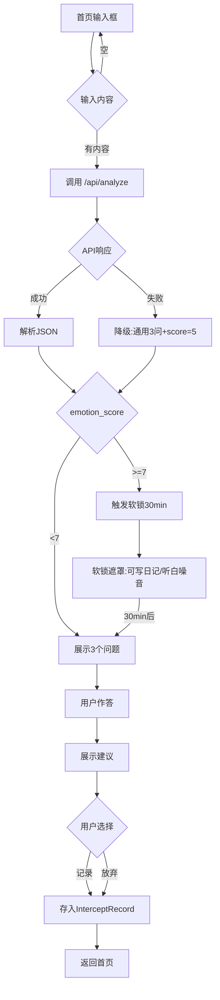
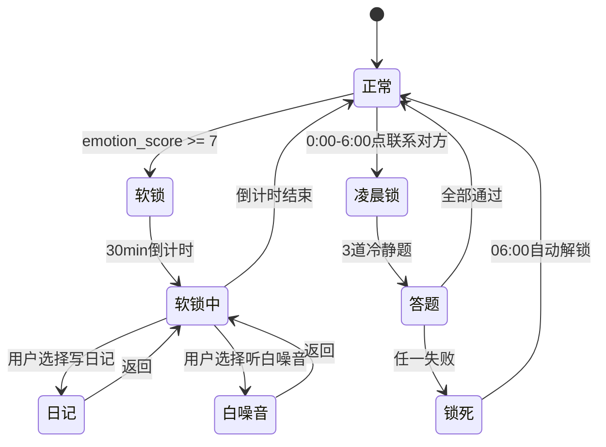
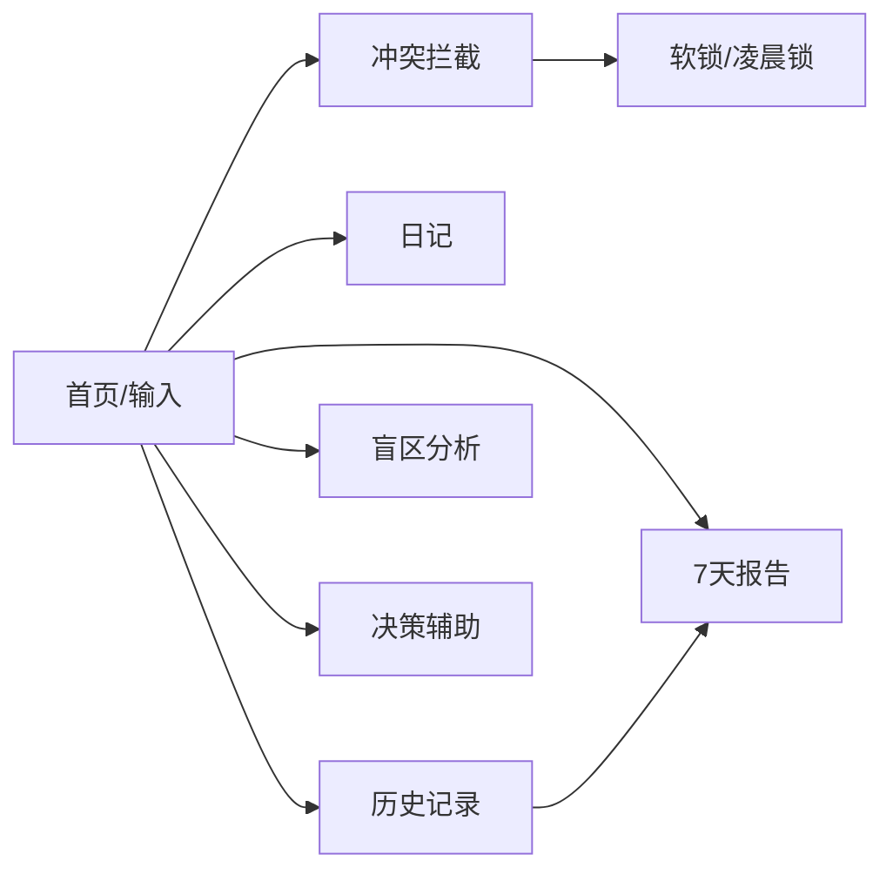

# 分手冷静室 · 开发文档 (初赛版 v0.2)

> 赛事:TRAE AI 创造力大赛 · 初赛(专业评审通道)
> 赛道:生活娱乐
> 时间:2026-06-17 → 07-15(约4周)
> 平台:Flutter(App) + Flutter Web(体验地址)
> AI:DeepSeek 为主,豆包/通义备选
> 开发环境:**TRAE IDE**(强制要求)
> 报名审核:**已通过** ✅
> 文档版本:v0.2 · 2026-06-17

---

## 0. 本次调整说明(相对 v0.1)

| 项 | v0.1 | v0.2 | 原因 |
|---|---|---|---|
| 时间 | 2周 | 4周(到7/15) | 初赛截止7/15 |
| MVP功能数 | 3个 | 6个全做 | 4周够,且评审看完整度 |
| 体验地址 | 无 | Flutter Web 部署 | 提交物硬要求 |
| 开发环境 | 未指定 | **TRAE IDE 强制** | 赛事硬约束 |
| 过程证据 | 无 | **Session ID≥3 + 截图≥3** | 评审最看重,硬指标 |
| 提交物 | 无 | Demo作品帖(4部分) | 赛事要求 |

---

## 1. 初赛要求速查(务必遵守)

### 1.1 硬性要求(不达标直接出局)
- [x] 报名审核已通过
- [ ] **必须用 TRAE IDE / TRAE Work 完成开发**(能提供过程证明)
- [ ] Demo 与报名创意方向一致(分手冷静室 ✅)
- [ ] 提供可体验地址(我们用 Flutter Web 部署)
- [ ] **关键步骤截图 ≥ 3 张**
- [ ] **关键任务 Session ID ≥ 3 个**(双击 TRAE 对话复制)
- [ ] 参赛帖结构完整

### 1.2 评审重点(原文)
> "把任务怎么拆解、用了TRAE哪些能力、关键Prompt/操作、踩过的坑都讲出来,这是评审最看重的。"
> "核心功能能跑通、能让人体验到价值,就是一个合格的初赛Demo。"

**结论:过程展示 > 完美成品。** 开发全程必须留存证据(见第 8 章)。

### 1.3 提交物清单(Demo作品帖)
1. 标签:`生活娱乐`
2. 标题:`生活娱乐 + 分手冷静室`
3. 正文4部分:
   - ① Demo简介(形态/用户/2-3核心功能,**配截图**)
   - ② 创作思路(灵感/痛点/取舍)
   - ③ 体验地址(Flutter Web 链接)
   - ④ TRAE实践过程(流程 + ≥3截图 + ≥3 Session ID)
4. 附:已通过的报名帖链接

### 1.4 关键时间节点
| 节点 | 时间 |
|---|---|
| 开发期 | 06-17 → 07-14 |
| 提交截止 | **07-15 23:59:59** |
| 公示 | 07-21 → 07-23 |

---

## 2. 产品范围(4周可完整交付)

落地页 6 个功能全部实现,但分核心层与增强层,优先保核心。

### 核心层(必做,Week 1-2)
1. **冲突拦截** — 输入想发的话 → AI 返回3个结构化问题 → 作答 → 建议
2. **发疯指数仪表盘** — 1-10实时评估,≥7触发30分钟软锁
3. **凌晨软锁** — 0:00-6:00 联系对方需过3道冷静题

### 增强层(Week 3,做完整度)
4. **盲区分析** — 基于历史记录,AI 指出行为模式
5. **7天关系体检报告** — 结构化报告生成
6. **挽回/放手决策辅助** — 输入对方行为模式,输出沉没成本vs未来预期

### 明确不做(边界)
- 账号登录/云同步(纯本地)
- 推送通知(2周搞不定审核)
- 接入真实聊天记录(隐私合规风险)
- 社交分享

---

## 3. 技术架构

### 3.1 选型

| 层 | 选型 | 理由 |
|---|---|---|
| 框架 | Flutter 3.x | 一套代码 → App + Web 双端 |
| 状态管理 | Riverpod | 适合中大型,TRAE 生成质量好 |
| 本地存储 | Hive | 轻量,Web 端兼容 |
| 路由 | go_router | 声明式,Web 端 URL 友好 |
| 网络 | dio | 拦截器/超时/重试 |
| AI | DeepSeek Chat API | 性价比高、国内直连 |
| Web 部署 | **Cloudflare Pages** | 免费、全球CDN、自带Functions可做API代理 |
| API 代理 | Cloudflare Pages Functions | **藏 API Key**(Web端硬需求,见 3.3) |

### 3.2 架构图

```
┌──────────────────────────────────────┐
│  Flutter App (本地)                   │
│  UI层 → 业务逻辑层 → 本地数据层(Hive)  │
└──────────────┬───────────────────────┘
               │ HTTPS
        ┌──────▼──────────────┐
        │ Cloudflare Pages     │
        │ (托管 Flutter Web)   │
        └──────┬──────────────┘
               │ 同域 Functions 代理
        ┌──────▼──────────────┐
        │ DeepSeek API         │
        └─────────────────────┘
```

### 3.3 API Key 安全(关键决策)

**问题**:Flutter Web 编译后是前端 JS,API Key 直接暴露会被盗刷。

**方案**:用 Cloudflare Pages Functions 做一层代理。
- 前端只调 `https://你的域名/api/analyze`
- Functions 内置 Key(环境变量),转发到 DeepSeek
- Functions 可加速率限制(每IP每分钟10次)

**App 端**:可直连 DeepSeek(代码不公开),也可统一走代理。建议**统一走代理**,一套逻辑、一份限流。

```
// functions/api/analyze.js  (Cloudflare Pages Function)
export async function onRequestPost({ request, env }) {
  const { message } = await request.json();
  const resp = await fetch("https://api.deepseek.com/v1/chat/completions", {
    method: "POST",
    headers: {
      "Authorization": `Bearer ${env.DEEPSEEK_KEY}`,
      "Content-Type": "application/json"
    },
    body: JSON.stringify({
      model: "deepseek-chat",
      response_format: { type: "json_object" },
      messages: [{ role: "user", content: buildPrompt(message) }]
    })
  });
  return new Response(await resp.text(), {
    headers: { "Access-Control-Allow-Origin": "*" }
  });
}
```

---

## 4. 功能详细设计

### 4.1 冲突拦截 v2（流式对话）

> v2 版本：流式对话界面，军师角色，不是一锤子结果。
> 核心变化：从"提交→loading→结果"改为"对话→追问→继续对话→共识"。

**对话流程：**

```
用户 → "你为什么总是不回我消息?!你是不是根本不在乎我!"
      ↓ 调 /api/intercept/chat（流式SSE）
AI（军师）→ "这条消息情绪分8分，确实很上头。"
           "不过我注意到几个问题，想和你聊聊："
           "① ...（分析消息里的模式）"
           "② ...（对方的视角）"
           "③ ...（发完会怎样）"
           ""
           "来，先回答我三个问题，帮你自己看清楚："
           ""
           "Q1: 你发这条消息，希望对方看到后什么反应？
           Q2: 如果对方没按你期望的反应来，你会怎样？
           Q3: 这条消息本质是沟通还是情绪宣泄？"
      ↓ 用户作答（表单形式提交）
用户 → "我希望他道歉…如果他道歉了我就不发了…应该是宣泄吧"
      ↓ 发 /api/intercept/answer（流式SSE）
AI（军师）→ "好，你已经看到了——你本质是想要被看见、被在乎。"
           "所以问题是：这条消息能让你被看见吗？"
           "从你描述的来看，对方已读不回往往是因为…"
           ""
           "我有个建议：不发这条，改天当面说。
           或者，发之前先说'我有点难过，能聊聊吗？'
           把宣泄变成沟通，你觉得呢？"
      ↓ 用户可继续对话或结束
```

**API 设计（流式 SSE）：**

```
POST /api/intercept/chat
  请求: { message: string, history?: Message[] }
  响应: text/event-stream（流式）
  首条消息: { type: "analysis", emotion_score: number, emotion_label: string }
  后续消息: { type: "text", content: string }
  结束: { type: "done" }

POST /api/intercept/answer
  请求: { answers: string[], history: Message[] }
  响应: text/event-stream（流式）
  内容: 军师针对三个答案的深度回应 + 继续追问或给建议
  结束: { type: "done", suggestion?: string }
```

**AI System Prompt（军师人设）：**
```
你是"分手冷静室"的军师顾问——一个有温度、有洞察、不会替你做决定的朋友。
不是冷冰冰的AI，是会在深夜陪你想清楚的那个人。

你的风格：
1. 先共情，再说问题。不评判，不灌鸡汤。
2. 会指出用户看不到的模式（行为模式、情绪模式）
3. 会站在对方视角看问题
4. 问尖锐但建设性的问题
5. 给建议时，不说"你应该怎样"，而是"我注意到…你想想看…"
6. 最终决定权永远在用户手里

当用户发来一条想发的消息，你的第一轮回复格式：
- 先给情绪评分（用括号标注：🔥8分/⚠️5分/💙2分）
- 分析这条消息里的1-2个值得注意的点
- 提出3个让用户自己想清楚的问题（这3个问题作为表单呈现）
- 不要直接说"发"或"不发"

当用户回答了问题，你的回复：
- 针对用户的具体回答给出回应
- 可以追问1个最关键的问题
- 或者直接给出你的观察和建议
- 建议用"我有个想法…"开头，给用户留空间
```

**情绪评分标注：**
- 💙 1-3 冷静（蓝色）
- ⚠️ 4-6 焦虑（黄色）
- 🔥 7-10 冲动（红色）

**降级方案：** DeepSeek 流式失败 → 降级为普通JSON响应（退化为v1体验）。

### 4.2 发疯指数仪表盘
- 复用 `emotion_score`,无需额外调用
- 1-3绿/4-6黄/7-10红
- ≥7:**30分钟软锁**,全屏遮罩 + "现在说的话,明天醒来你会想删"
- 软锁期:可写日记/听白噪音,不可进"联系对方"
- 解锁:30min倒计时自然解锁(debug build 可5连击标题强解)

### 4.3 凌晨软锁
- 0:00-6:00 点"联系对方"→ 3道题(本地题库20道,随机抽)
  - 算术(激活前额叶):"17×8=?"
  - 自评:"愤怒值1-10?"
  - 延时:"等60秒再答"
- 全过→放行(记录"凌晨解锁");任一失败→锁死到06:00

### 4.4 盲区分析
- 输入:近7天 InterceptRecord
- AI prompt:统计"你从来都不"类绝对化用语频次、情绪峰值时段,指出模式
- 输出:3条盲区观察

### 4.5 7天关系体检报告
- 聚合7天记录:争吵触发点、情绪峰值时段、对方高频雷区、你常犯的3个错
- AI 生成结构化报告(Markdown)
- 本地缓存,可查看历史报告

### 4.6 挽回/放手决策辅助
- 表单输入对方5个核心行为模式
- AI 输出:沉没成本 vs 未来预期评估 + 不替你决定的提醒

---

## 5. 数据模型 (PG)

### v2 对话消息结构（新增）

```go
// Message 对话中的一条消息
type Message struct {
    Role    string `json:"role"`    // "user" | "assistant"
    Content string `json:"content"`
}
```

### InterceptRecord v2

```go
type InterceptRecord struct {
    ID           string   `json:"id"`
    RawMessage   string   `json:"raw_message"`     // 用户原始输入
    EmotionScore int      `json:"emotion_score"`   // 1-10
    EmotionLabel string   `json:"emotion_label"`   // 冷静|焦虑|冲动|暴怒
    AIAnalysis   string   `json:"ai_analysis"`     // AI第一轮分析文本
    Questions    []string `json:"questions"`       // 3个问题文本
    History      []Message `json:"history"`        // 对话历史（含问答）
    Suggestion   *string  `json:"suggestion"`     // 最终建议
    ActuallySent bool     `json:"actually_sent"`
    CreatedAt    string   `json:"created_at"`
}
```

### v2 API 响应类型

```typescript
// 流式首帧
interface AnalysisFrame {
  type: "analysis";
  emotion_score: number;
  emotion_label: string;
}

// 流式文本帧
interface TextFrame {
  type: "text";
  content: string;
}

// 流式结束帧
interface DoneFrame {
  type: "done";
  questions?: string[];  // 第一轮返回3个问题
  suggestion?: string;   // 最终建议
}
```

```dart
@HiveType(typeId: 0)
class InterceptRecord extends HiveObject {
  @HiveField(0) String id;
  @HiveField(1) String rawMessage;
  @HiveField(2) int emotionScore;        // 1-10
  @HiveField(3) List<String> questions;
  @HiveField(4) List<String?> answers;
  @HiveField(5) String? suggestion;
  @HiveField(6) bool actuallySent;
  @HiveField(7) DateTime createdAt;
}

@HiveType(typeId: 1)
class LockState extends HiveObject {
  @HiveField(0) bool isLocked;
  @HiveField(1) DateTime? unlockAt;
  @HiveField(2) String reason;
}

@HiveType(typeId: 2)
class JournalEntry extends HiveObject {
  @HiveField(0) String id;
  @HiveField(1) String content;
  @HiveField(2) int mood;
  @HiveField(3) DateTime createdAt;
}

@HiveType(typeId: 3)
class Report extends HiveObject {        // 7天报告
  @HiveField(0) String id;
  @HiveField(1) String markdown;
  @HiveField(2) DateTime periodStart;
  @HiveField(3) DateTime createdAt;
}
```

---

## 6. 项目结构

```
cooling_chamber/
├── lib/
│   ├── main.dart
│   ├── core/
│   │   ├── theme.dart          # 复用落地页配色
│   │   ├── router.dart
│   │   └── storage.dart        # Hive 初始化
│   ├── data/
│   │   ├── models/
│   │   ├── repositories/
│   │   └── ai_service.dart     # 调 /api/analyze
│   ├── features/
│   │   ├── home/
│   │   ├── intercept/          # 拦截3问
│   │   ├── lock/               # 软锁+凌晨锁
│   │   ├── journal/
│   │   ├── history/
│   │   ├── insight/            # 盲区分析
│   │   ├── report/             # 7天报告
│   │   └── decide/             # 决策辅助
│   └── shared/
├── functions/                  # Cloudflare Pages Functions
│   └── api/
│       └── analyze.js
├── evidence/                   # ⭐ 过程证据(TRAE截图+Session ID)
│   ├── screenshots/
│   └── session_ids.md
└── build/web/                  # flutter build web 产物
```

---

## 7. 开发排期(4周)

### Week 1 (06-17 → 06-23) 主干打通
| 日 | 任务 | 产出 |
|---|---|---|
| 17 | TRAE IDE 装好;`flutter create`;加依赖;theme;空壳跑通 | 能跑 |
| 18 | 首页+输入框+Hive;Cloudflare Pages 部署空壳Web | Web可访问 |
| 19 | `functions/api/analyze.js` 代理;ai_service 调通 | console见AI返回 |
| 20 | 拦截流程页:loading→3问→作答→建议;JSON解析+降级 | 核心闭环跑通 |
| 21 | 情绪仪表盘组件;分级配色;≥7触发软锁 | 仪表盘+软锁 |
| 22 | 凌晨锁:时间判断+题库+3题+锁死 | 凌晨锁可用 |
| 23 | 历史记录页+日记页(最简);全流程联调 | 核心层完成 |

### Week 2 (06-24 → 06-30) 增强功能
| 日 | 任务 | 产出 |
|---|---|---|
| 24 | 盲区分析:聚合记录+AI prompt+展示 | 功能4完成 |
| 25 | 7天报告:数据聚合+AI生成+Markdown渲染 | 功能5完成 |
| 26 | 决策辅助:表单+AI评估+展示 | 功能6完成 |
| 27 | AI prompt 调优:20条真实案例测试 | prompt定稿 |
| 28 | 体验打磨:动画/空状态/错误态/加载态 | 像产品 |
| 29 | iOS真机+Android真机调试 | 双端真机跑通 |
| 30 | Web 端专项调试:响应式/CORS/限流 | Web稳定 |

### Week 3 (07-01 → 07-07) 打磨与证据
| 日 | 任务 | 产出 |
|---|---|---|
| 01 | 性能:冷启动优化、API超时重试、离线降级 | 稳定不崩 |
| 02 | 演示数据+演示脚本撰写 | 可演示 |
| 03 | **整理 TRAE 过程证据**(见第8章) | 证据齐全 |
| 04 | 录制关键步骤截图(≥3)+ 收集Session ID(≥3) | 硬指标达成 |
| 05 | 撰写Demo作品帖正文(4部分) | 帖子初稿 |
| 06 | 配图:产品截图、界面展示 | 配图完成 |
| 07 | 帖子Review+改稿 | 帖子定稿 |

### Week 4 (07-08 → 07-15) 兜底与提交
| 日 | 任务 | 产出 |
|---|---|---|
| 08-10 | 兜底:补未完成项、修bug、再次prompt调优 | 全验收项过 |
| 11 | Web 部署最终检查;体验链接可用性验证 | 链接稳定 |
| 12 | Demo帖最终校对;截图/Session ID核对 | 提交就绪 |
| 13 | 预演:按评审视角自检4维度 | 自检通过 |
| 14 | **提交**(留1天缓冲) | 已提交 |
| 15 | 截止 23:59:59 | — |

---

## 8. ⭐ TRAE 过程证据收集(评审最看重)

> 这章是初赛晋级的命门。技术做得再好,没有过程证据会被判非TRAE开发而出局。

### 8.1 Session ID 收集
- **每次**在 TRAE IDE 里让 AI 生成关键代码,结束后**双击该对话 → 复制 → 粘到 `evidence/session_ids.md`**
- 至少保留 3 个,建议多留(覆盖各功能)
- 记录格式:
  ```markdown
  ## Session 1 — 拦截流程页 + AI Service
  - Session ID: xxxxxxxx
  - 日期: 2026-06-19
  - 任务: 用 TRAE 生成 ai_service.dart 和拦截页
  - 关键Prompt: "帮我用 dio 实现 DeepSeek 调用,返回JSON..."
  ```

### 8.2 关键步骤截图(≥3张,建议6-8张)
存 `evidence/screenshots/`,建议覆盖:
1. TRAE IDE 中创建项目/初始化
2. 用 TRAE 生成核心代码(ai_service / 拦截页)
3. TRAE 智能体执行复杂任务(如生成完整feature)
4. 调试/修bug 过程
5. Web 部署成功
6. 真机运行

### 8.3 日常习惯(从 Day 1 起)
- 开发**只在 TRAE IDE 里做**(不要切到别的IDE,否则证据断裂)
- 每个feature开一个新对话,便于Session ID对应
- 关键prompt原文留存(写进 session_ids.md)
- 踩坑过程随手记(写进Demo帖"创作思路"和"TRAE实践")

---

## 9. 风险与对策

### 9.1 高风险
| 风险 | 对策 |
|---|---|
| Web 端 API Key 暴露 | Cloudflare Functions 代理(3.3) |
| DeepSeek 不稳 | 备选豆包/通义,provider可切换;本地降级 |
| AI 返回非JSON | response_format:json_object + 正则兜底 + 重试 + 静态降级 |
| 4周做不完 | 严格守优先级:核心层(1-3)必保,增强层(4-6)可砍 |
| 过程证据不足 | 第8章从Day1执行,Week3专门整理 |
| Web 部署/CORS | 同域 Functions 代理规避CORS |

### 9.2 伦理风险(答辩/评审必问)
- **强制锁误伤急事** → 软锁30min自然解,凌晨锁有解题通道
- **不接真实聊天记录** → 盲区分析用用户自述,不读微信
- **不替用户决定** → 所有prompt强调"你自己决定"
- 落地页"80%"等数字 → Demo帖软化表述,避免硬伤

### 9.3 已知技术债(上线前还)
- [ ] 无账号/云同步 → 上线需加
- [ ] 无推送 → 凌晨锁仅App内生效
- [ ] API Key经Functions代理 → 已缓解,正式上线需加用户鉴权+计费

---

## 10. v0.2 提交检查清单(07-14 用)

- [ ] Flutter App 双端真机跑通
- [ ] Flutter Web 部署可公开访问,体验链接稳定
- [ ] 6功能均可体验
- [ ] TRAE 截图 ≥ 3 张
- [ ] TRAE Session ID ≥ 3 个
- [ ] Demo帖4部分齐全 + 配图
- [ ] 附报名帖链接
- [ ] 体验链接提交前实测可打开

---

## 11. 立即开始(Day 1 · 今天 06-17)

- [ ] 下载安装 TRAE IDE(https://www.trae.cn)
- [ ] 装 Flutter SDK + 配 iOS/Android 环境
- [ ] 注册 DeepSeek,充 ¥10,拿 API Key
- [ ] 在 **TRAE IDE** 里 `flutter create cooling_chamber`
- [ ] 加依赖:riverpod, go_router, hive, dio, flutter_dotenv
- [ ] 把落地页配色写进 `theme.dart`
- [ ] 建 `evidence/` 文件夹,开始记 Session ID
- [ ] 注册 Cloudflare 账号(备 Week1 部署用)

> 跑通 Day 1 后回来,我帮你在 TRAE 里写首页 + AI Service + Cloudflare Function 代理的具体代码。

---

## 12. 附录 · 开发补充文档 (v0.3 补充)

> 本附录为初赛 Demo 阶段补充,聚焦"4周内能交付、能演示"。
> 文档版本:v0.3 · 2026-06-17

### 12.1 初赛阶段技术栈聚焦

**决策:初赛只做 Flutter Web,真机 App 留决赛。**

| 项 | 原计划(v0.2) | 初赛调整(v0.3) | 原因 |
|---|---|---|---|
| 端 | App + Web 双端 | **仅 Flutter Web** | 初赛只需"可体验地址",Web 够用 |
| 真机调试 | iOS + Android | **不做** | 省下 Week2 末尾 2 天,投入体验打磨 |
| 验收项 | "双端真机跑通" | "Web 端体验流畅" | 见下方清单调整 |
| API Key | Cloudflare Functions 代理 | **不变** | Web 端硬需求,必须代理 |

**v0.3 提交检查清单(替代第10章)**

- [ ] Flutter Web 部署可公开访问,体验链接稳定
- [ ] Web 首屏 < 3s(加 loading 动画)
- [ ] 6功能均可体验
- [ ] TRAE 截图 ≥ 3 张
- [ ] TRAE Session ID ≥ 3 个
- [ ] Demo帖4部分齐全 + 配图
- [ ] 附报名帖链接
- [ ] 体验链接提交前实测可打开(手机+电脑各1次)

---

### 12.2 AI Prompt 全套(6功能)

> 所有 prompt 在 TRAE IDE 中迭代,每次定稿后复制到 `evidence/session_ids.md`。
> 统一规则:除"7天报告"返回 Markdown 外,其余返回严格 JSON。

#### 12.2.1 冲突拦截(核心)

**System Prompt:**
```
你是"分手冷静室"的冷静教练。用户深夜想给伴侣/前任发一条消息。
你的任务:不替用户做决定,问3个让他自己想清楚的问题。

用户想发的消息:"{{user_input}}"

返回严格JSON,不要输出JSON以外的任何内容:
{
  "emotion_score": 1到10的整数,
  "emotion_label": "冷静" | "焦虑" | "冲动" | "暴怒" 之一,
  "questions": [
    {"q": "针对这条消息的具体问题1", "hint": "引导用户看到什么"},
    {"q": "针对这条消息的具体问题2", "hint": "..."},
    {"q": "针对这条消息的具体问题3", "hint": "..."}
  ],
  "suggestion_preview": "若用户答完,倾向发/不发/改写的一句话理由"
}

要求:
1. 三个问题层层递进:意图 → 后果 → 替代方案
2. 问题必须针对用户输入的具体内容,不要泛泛而谈
3. emotion_score 分级:1-3冷静, 4-6焦虑, 7-10冲动
4. 只返回JSON
```

**测试用例:**

| 输入 | 期望 score | 期望问题方向 |
|---|---|---|
| "你为什么总是不回我消息?!你是不是根本不在乎我!" | 8-9 | 你希望对方看到后什么反应 / 如果对方不回你会怎样 / 这是沟通还是宣泄 |
| "我们分手吧,我累了" | 9 | 你说累了是身体累还是心累 / 分手是想要结束还是想要被挽留 / 如果对方同意你什么感受 |
| "你今天怎么没跟我说早安" | 4 | 没说早安让你联想到了什么 / 你希望对方怎么做 / 直接问对方还是先观察一天 |

**降级方案:** JSON 解析失败 → 重试1次 → 仍失败用内置3通用问题 + score=5:
```json
{
  "emotion_score": 5,
  "emotion_label": "焦虑",
  "questions": [
    {"q": "你发这条消息,希望对方看到后做什么?", "hint": "看清自己的真实意图"},
    {"q": "如果对方反应不如预期,你会怎样?", "hint": "预判后果"},
    {"q": "这条消息是沟通还是情绪宣泄?", "hint": "区分目的"}
  ],
  "suggestion_preview": "先想清楚再发"
}
```

#### 12.2.2 发疯指数仪表盘

**不单独调用 AI。** 复用冲突拦截返回的 `emotion_score` + `emotion_label`。

| score | 等级 | 颜色 | 行为 |
|---|---|---|---|
| 1-3 | 冷静 | 蓝 `#4F46E5` | 正常展示3问 |
| 4-6 | 焦虑 | 黄 `#F59E0B` | 正常展示3问 |
| 7-10 | 冲动 | 红 `#DC2626` | 触发30分钟软锁 |

#### 12.2.3 盲区分析

**System Prompt:**
```
你是"分手冷静室"的关系观察者。基于用户过去7天的拦截记录,指出他看不到的行为模式。

用户近7天记录(JSON数组):
{{records_json}}

每条记录字段:rawMessage(想发的话), emotionScore, createdAt, actuallySent

返回严格JSON:
{
  "observations": [
    {
      "pattern": "观察到的模式名称",
      "evidence": "从哪些记录看出来的",
      "insight": "这个模式意味着什么"
    }
  ],
  "peak_hours": "情绪峰值时段,如'23:00-01:00'",
  "frequent_words": ["高频绝对化用语1", "用语2"]
}

要求:
1. 最多3条观察,少而精
2. 语气是"观察"不是"诊断",用"我注意到"而非"你有问题"
3. 如果记录少于3条,返回 observations 空数组,并在 peak_hours 写"数据不足"
4. 只返回JSON
```

**测试用例:**
- 输入:3条记录,均含"你从来都不",均在23:00-01:00
- 期望:observations 指出"绝对化表达"模式,peak_hours="23:00-01:00",frequent_words 含"你从来都不"

#### 12.2.4 7天关系体检报告

**System Prompt:**
```
你是"分手冷静室"的报告撰写者。基于用户过去7天的数据,生成一份《关系体检报告》。

用户数据:
- 拦截记录:{{records}}
- 日记条目:{{journals}}
- 情绪分数分布:{{score_distribution}}

直接返回 Markdown 格式报告(不要包裹在代码块里),包含以下章节:

## 📊 这7天,你经历了什么
(数据概览:触发拦截X次,实际发送Y次,情绪平均分Z)

## 🔥 你的争吵触发点
(Top3 触发词或场景)

## ⏰ 你的情绪峰值时段
(哪个时段最容易冲动)

## ⚠️ 你最容易犯的3个错
(具体、可改进)

## 💡 下周建议
(1-2条可执行建议,不替用户做决定)

要求:
1. 语气诚恳,像朋友复盘,不像医生下诊断
2. 用数据说话,引用具体记录
3. 如果数据不足7天,如实说明"目前记录X天,以下是基于现有数据的观察"
4. 直接返回 Markdown 正文
```

**测试用例:**
- 输入:5条拦截记录,2条日记,平均分6.4
- 期望:报告包含5个章节,引用具体记录内容,建议可执行

#### 12.2.5 挽回/放手决策辅助

**System Prompt:**
```
你是"分手冷静室"的决策辅助者。用户在纠结该挽回还是该放手。
你的任务:不替用户决定,帮他想清楚"沉没成本 vs 未来预期"。

用户输入的对方5个核心行为模式:
{{behaviors}}

用户输入的关系背景(可选):
{{context}}

返回严格JSON:
{
  "sunk_cost": {
    "time": "时间投入观察",
    "emotion": "情感投入观察",
    "summary": "沉没成本一句话总结"
  },
  "future_expectation": {
    "positives": ["未来可能的积极面1", "积极面2"],
    "risks": ["未来可能的风险1", "风险2"],
    "summary": "未来预期一句话总结"
  },
  "questions_to_self": [
    "让用户自己思考的问题1",
    "问题2",
    "问题3"
  ],
  "reminder": "不替用户决定的免责声明,一句话"
}

要求:
1. 基于用户输入的5个行为模式分析,不编造
2. 沉没成本和未来预期都要客观,不偏向挽回或放手
3. questions_to_self 要尖锐但建设性
4. 只返回JSON
```

**测试用例:**
- 输入行为模式:["每次吵架都冷暴力3天","从不主动道歉","但生病时会照顾我","记得所有纪念日","对我父母很好"]
- 期望:sunk_cost 提到情感投入,future_expectation 同时列出冷暴力风险和照顾/记念的积极面,questions 含"你能接受长期冷暴力吗"

#### 12.2.6 凌晨锁题库(本地,不调AI)

**算术题(激活前额叶,20题随机抽1):**
```
17×8=?  → 136
23+49=? → 72
15×6=?  → 90
81-37=? → 44
9×13=?  → 117
... (共20题,难度相当于心算两位数)
```

**自评题(随机抽1):**
```
Q: 你现在的愤怒值是多少?(1-10)
Q: 如果现在发了,明天醒来后悔的概率是多少?(0-100%)
Q: 你觉得对方看到这条消息会是什么反应?(文字输入)
```

**延时题:**
```
Q: 请等待60秒后再回答:现在还想发吗?(是/否)
(倒计时60s,期间显示呼吸引导动画)
```

**规则:** 3题全部通过 → 放行(记录"凌晨解锁");任一失败 → 锁死到06:00。

---

### 12.3 页面流程图

#### 12.3.1 拦截核心流程



#### 12.3.2 软锁状态机



#### 12.3.3 整体页面导航



---

### 12.4 演示脚本 + 演示数据

#### 12.4.1 演示路径(3-5分钟)

```
1. 首页(10s)
   → 介绍:"分手冷静室,深夜想发消息前先来这里"
   
2. 冲突拦截 - 冲动场景(60s)
   → 输入演示数据①:"你为什么总是不回我消息?!你是不是根本不在乎我!"
   → 等待AI返回(展示loading:"冷静教练正在看你的消息...")
   → 发疯指数爆表(score 8-9,红色仪表盘)
   → 触发软锁,展示遮罩:"现在说的话,明天醒来你会想删"
   → (debug强解,跳过30min)展示3个问题
   
3. 冲突拦截 - 焦虑场景(40s)
   → 输入演示数据③:"你今天怎么没跟我说早安"
   → score 4,黄色仪表盘
   → 正常展示3问,用户作答
   → 展示建议
   
4. 7天报告(40s)
   → 进入报告页,展示预置的演示报告
   → 指出"情绪峰值时段""高频雷区"
   
5. 结尾(10s)
   → "深夜想发的消息,多数不如等到天亮"
```

#### 12.4.2 演示数据(预置,避免现场打字)

**拦截输入样本:**

| 编号 | 内容 | 预期score | 场景 |
|---|---|---|---|
| ① | "你为什么总是不回我消息?!你是不是根本不在乎我!" | 8-9 | 冲动·质问 |
| ② | "我们分手吧,我累了" | 9 | 冲动·决绝 |
| ③ | "你今天怎么没跟我说早安" | 4 | 焦虑·小事 |
| ④ | "我看到你朋友圈了,你过得挺好啊" | 7 | 冲动·阴阳 |
| ⑤ | "我知道错了,我们和好好不好" | 6 | 焦虑·求和 |

**演示用历史记录(预置到Hive,用于盲区分析/报告演示):**

```json
[
  {"rawMessage": "你从来都不听我说话!", "emotionScore": 8, "createdAt": "2026-06-15T23:30:00", "actuallySent": true},
  {"rawMessage": "你总是这样,从来不考虑我的感受", "emotionScore": 7, "createdAt": "2026-06-14T00:15:00", "actuallySent": false},
  {"rawMessage": "你从来都不主动找我", "emotionScore": 6, "createdAt": "2026-06-13T23:50:00", "actuallySent": true},
  {"rawMessage": "算了,你永远都不会改的", "emotionScore": 8, "createdAt": "2026-06-12T01:20:00", "actuallySent": false},
  {"rawMessage": "你能不能回我一下", "emotionScore": 5, "createdAt": "2026-06-11T23:45:00", "actuallySent": true}
]
```

**实现方式:** 首次启动时检测 Hive 是否为空,为空则写入演示数据(可在设置里清除)。

---

### 12.5 错误处理矩阵

| 场景 | 触发条件 | 处理方式 | 用户感知 |
|---|---|---|---|
| API超时 | >15s无响应 | 重试1次→提示 | "网络不稳,稍后再试" |
| DeepSeek限流 | HTTP 429 | 本地降级 | 通用3问 + score=5 |
| 完全断网 | fetch失败 | 拦截功能不可用 | 引导写日记 |
| AI返回非JSON | JSON.parse失败 | 正则提取→失败用静态降级 | 通用3问 |
| AI返回字段缺失 | 必填字段为空 | 字段补默认值 | 正常流程 |
| AI返回内容异常 | 字段类型错误 | 静态降级 | 通用3问 |
| Hive存储失败 | Web localStorage满(>5MB) | 清理7天前数据后重试 | 无感 |
| 凌晨锁答题超时 | 60s延时题未完成 | 视为失败 | 锁死到06:00 |
| Web首屏白屏 | Flutter引擎加载慢 | index.html内置CSS loader | "正在为你准备冷静室..." |

---

### 12.6 DeepSeek API 参数规范

**统一参数(除报告外):**
```yaml
model: deepseek-chat
temperature: 0.7        # 略有创造性但可控
max_tokens: 1000        # JSON返回足够
response_format:
  type: json_object     # 强制JSON,需确认model支持
stream: false           # Demo不需要流式
```

**7天报告参数:**
```yaml
model: deepseek-chat
temperature: 0.8        # 报告略需文采
max_tokens: 2000        # Markdown较长
response_format: null   # 返回纯文本Markdown
stream: false
```

**调用示例(Cloudflare Function):**
```javascript
const resp = await fetch("https://api.deepseek.com/v1/chat/completions", {
  method: "POST",
  headers: {
    "Authorization": `Bearer ${env.DEEPSEEK_KEY}`,
    "Content-Type": "application/json"
  },
  body: JSON.stringify({
    model: "deepseek-chat",
    temperature: 0.7,
    max_tokens: 1000,
    response_format: { type: "json_object" },
    messages: [
      { role: "system", content: systemPrompt },
      { role: "user", content: userMessage }
    ]
  })
});
```

**限流(Cloudflare Function 内):**
- 每 IP 每分钟 10 次
- 超限返回 429 + `{"error": "rate_limited"}`

---

### 12.7 环境变量清单

**本地开发 `.env`:**
```
DEEPSEEK_KEY=sk-xxxxxxxxxxxxxxxx
API_BASE_URL=http://localhost:8788
DEBUG_UNLOCK=true
```

**Cloudflare Pages 环境变量(生产):**
```
DEEPSEEK_KEY=sk-xxxxxxxxxxxxxxxx
RATE_LIMIT_PER_MINUTE=10
DEBUG_UNLOCK=false
```

**说明:**
- `DEEPSEEK_KEY`:仅在 Cloudflare Function 内可访问,前端不可见
- `API_BASE_URL`:前端调用地址,本地用 `wrangler pages dev` 的8788端口,生产用同域
- `DEBUG_UNLOCK`:演示时设 `true` 允许5连击标题强解软锁;生产必须 `false`

---

### 12.8 组件清单

> TRAE 生成代码时,按组件拆分 prompt,质量更高。
> 例:"帮我实现 EmotionGauge 组件,接收 score(1-10) 和 label,展示半圆仪表盘..."

| 组件名 | 用途 | 输入 | 复用页面 |
|---|---|---|---|
| EmotionGauge | 情绪仪表盘 | score, label | 拦截页、历史详情 |
| LockOverlay | 软锁全屏遮罩 | unlockAt, reason | 拦截页 |
| QuestionCard | 拦截问题卡片 | question, hint, index | 拦截页 |
| SuggestionCard | 建议展示卡 | suggestion, emotionScore | 拦截页 |
| JournalEditor | 日记编辑器 | initialContent | 日记页、软锁中 |
| RecordList | 记录列表 | records[] | 历史页 |
| RecordItem | 单条记录 | record | 历史页 |
| ReportView | Markdown渲染 | markdown | 报告页 |
| BehaviorForm | 行为模式表单 | behaviors[] | 决策辅助页 |
| InsightCard | 盲区观察卡 | observation | 盲区分析页 |
| LoadingState | 加载态 | message? | 全局 |
| ErrorState | 错误态 | message, onRetry? | 全局 |
| EmptyState | 空状态 | title, subtitle | 历史、报告、盲区 |
| BreathingAnimation | 呼吸引导动画 | duration | 凌晨锁延时题、软锁中 |

**优先级:**
- P0(Week1必做):EmotionGauge, QuestionCard, SuggestionCard, LockOverlay, LoadingState
- P1(Week2):JournalEditor, RecordList, ReportView, BehaviorForm, InsightCard
- P2(Week3打磨):ErrorState, EmptyState, BreathingAnimation
